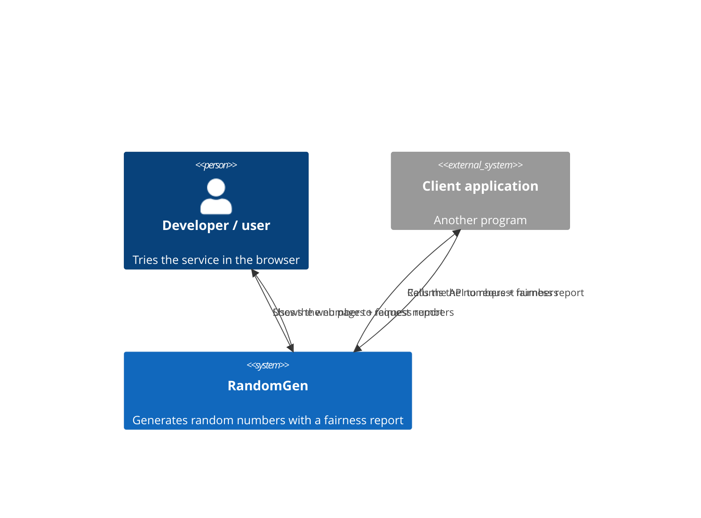

# 3. Context and Scope

This section describes the partners RandomGen exchanges data with, and what is
in and out of scope.

## 3.1 Business context

The business context shows who uses RandomGen and what they exchange with it. A
person uses the web page, other programs use the API, and RandomGen itself
depends on no downstream systems.

| Communication partner | Input | Output |
|-----------------------|-------|--------|
| Developer / user (person, via the web page) | Picks a quantity and, optionally, a distribution in the browser | The numbers and a Chi-Square fairness report, shown on the page |
| Client application (another program, via the API) | Requests a quantity and, optionally, a distribution | The numbers and a Chi-Square fairness report, as JSON |

## 3.2 Technical context

| Channel | Protocol | Notes |
|---------|----------|-------|
| Public API | HTTP/1.1, `GET` only | Served by gunicorn on `0.0.0.0:${PORT:-5000}`. Responses via Flask `jsonify`. No TLS in-process (terminated by the platform, e.g. Render). |
| Health | HTTP `GET /health` | Called by the container platform — the Docker `HEALTHCHECK` and Render's `healthCheckPath`; the platform also injects `$PORT`. No authentication. |
| `scipy` | in-process library call | `chi2.cdf` for the p-value. No network. |

The full request/response contract — parameters, response shape, and status
codes — is documented in [rest_api.md](../reference/rest_api.md).

## 3.3 Scope

**In scope**

- Generating *N* discrete random numbers from a configurable distribution
  (1..`MAX_NUMBERS` = 10000).
- Two interchangeable generators at `/api/v1` and `/api/v2`.
- A per-request distribution override (`dist` pairs or repeated
  `value`/`probability`), defaulting to the built-in distribution.
- A Chi-Square goodness-of-fit report on every generation response.
- Input validation with a stable JSON error contract.
- A `/health` liveness endpoint and an HTML home page at `/`.
- A machine-readable OpenAPI 3.1 spec at `/openapi.json` and an interactive
  API reference (ReDoc) at `/docs`.

**Out of scope**

- Persistence, configuration storage, or per-client state (the service is
  stateless).
- Authentication / authorization / rate limiting.
- Cryptographically secure randomness.
- Continuous distributions or non-`GET` mutating operations.
