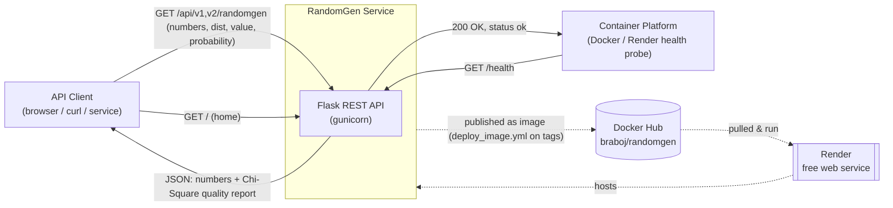

# 3. Context and Scope

This section delimits RandomGen from its environment and communication
partners. RandomGen is a self-contained service: it has no upstream
dependencies at runtime beyond the Python standard library and `scipy`, and it
talks to no databases or external services.

## 3.1 Business context

| Partner | Direction | Exchanged data |
|---------|-----------|----------------|
| **API client** (browser, `curl`, another service) | request → / ← response | **In:** HTTP `GET` with query params (`numbers`, `dist`, repeated `value`/`probability`). **Out:** JSON `{ "numbers": [...], "quality": {...} }`, an HTML home page, or `{"status":"ok"}`; on bad input, JSON `{"error": ...}` with HTTP 400/4xx/5xx. |
| **Container platform** (Docker, Render) | probes → | **In:** HTTP `GET /health` liveness probe; injected `$PORT`. **Out:** `{"status":"ok"}` + HTTP 200. |

### System context diagram

> Docker Hub and Render are **build/deploy targets**, not runtime
> communication partners — they are shown dotted. See
> [Section 7](07-deployment-view.md) for the deployment view.

## 3.2 Technical context

| Channel | Protocol | Notes |
|---------|----------|-------|
| Public API | HTTP/1.1, `GET` only | Served by gunicorn on `0.0.0.0:${PORT:-5000}`. Responses via Flask `jsonify`. No TLS in-process (terminated by the platform, e.g. Render). |
| Health | HTTP `GET /health` | Used by the Docker `HEALTHCHECK` and Render's `healthCheckPath`. No authentication. |
| `scipy` | in-process library call | `chi2.cdf` for the p-value. No network. |

The full request/response contract — parameters, response shape, and status
codes — is documented in [rest_api.md](../rest_api.md).

## 3.3 Scope

**In scope**

- Generating *N* discrete random numbers from a configurable distribution
  (1..`MAX_NUMBERS` = 10000).
- Two interchangeable generators at `/api/v1` and `/api/v2`.
- A per-request distribution override (`dist` pairs or repeated
  `value`/`probability`), defaulting to the built-in distribution.
- A Chi-Square goodness-of-fit report on every generation response.
- Input validation with a stable JSON error contract.
- A `/health` liveness endpoint and an HTML home page at `/`.

**Out of scope**

- Persistence, configuration storage, or per-client state (the service is
  stateless).
- Authentication / authorization / rate limiting.
- Cryptographically secure randomness.
- Continuous distributions or non-`GET` mutating operations.
