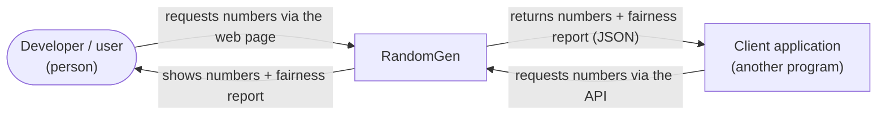
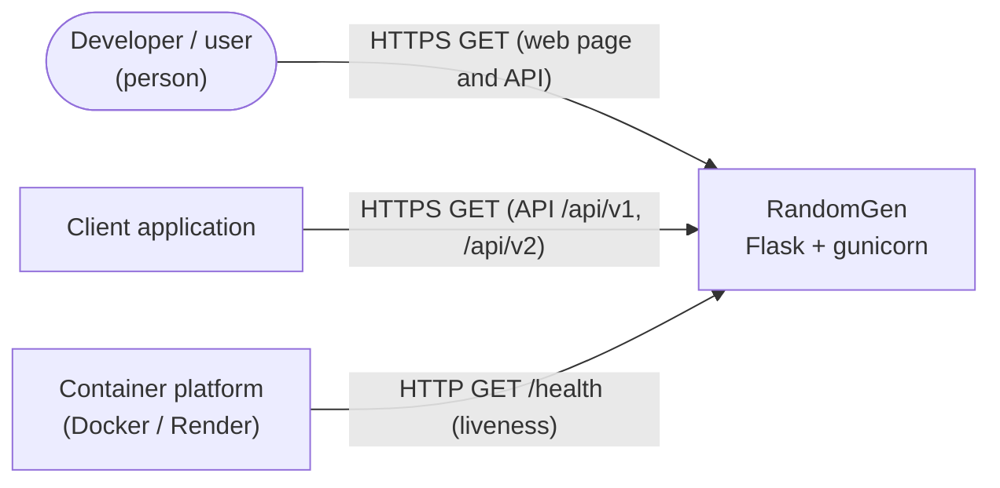

# 3. Context and Scope

This section describes the partners RandomGen exchanges data with, and what is
in and out of scope.

## 3.1 Business context

The business context shows who uses RandomGen and what they exchange with it. A
person uses the web page, other programs use the API, and RandomGen itself
depends on no downstream systems.

| Communication partner | Input | Output |
|-----------------------|-------|--------|
| Developer / user (person, via the web page) | Picks a quantity and, optionally, a distribution in the browser | The numbers and a Chi-Square fairness report, shown on the page |
| Client application (another program, via the API) | Requests a quantity and, optionally, a distribution | The numbers and a Chi-Square fairness report, as JSON |

## 3.2 Technical context

The technical context shows the runtime channels that connect RandomGen to its
environment, and which data travels over each. Build and deployment are out of
scope here.

| Channel | Protocol | Notes |
|---------|----------|-------|
| Public API | HTTP/1.1, `GET` only | Served by gunicorn on `0.0.0.0:${PORT:-5000}`. Responses via Flask `jsonify`. No TLS in-process (terminated by the platform, e.g. Render). |
| Health | HTTP `GET /health` | Called by the container platform — the Docker `HEALTHCHECK` and Render's `healthCheckPath`; the platform also injects `$PORT`. No authentication. |
| `scipy` | in-process library call | `chi2.cdf` for the p-value. No network. |

The full request/response contract — parameters, response shape, and status
codes — is defined by the OpenAPI document
[`openapi.yaml`](../../src/randomgen/openapi.yaml), served verbatim at
`/openapi.json` and rendered as an interactive reference (ReDoc) at `/docs`.

## 3.3 Scope

**In scope** — the functional requirements in
[Section 1](01-introduction-and-goals.md) (§1.1, FR01–FR07), delivered over the
interfaces in §3.1 and §3.2.

**Out of scope**

- Persistence, configuration storage, or per-client state (the service is
  stateless).
- Authentication / authorization / rate limiting.
- Cryptographically secure randomness.
- Continuous distributions or non-`GET` mutating operations.
