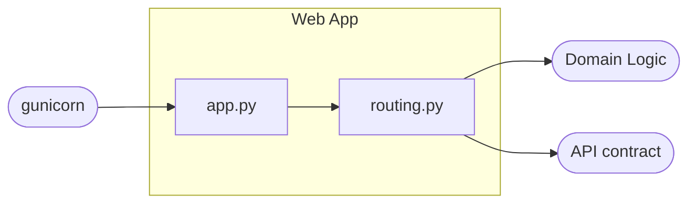
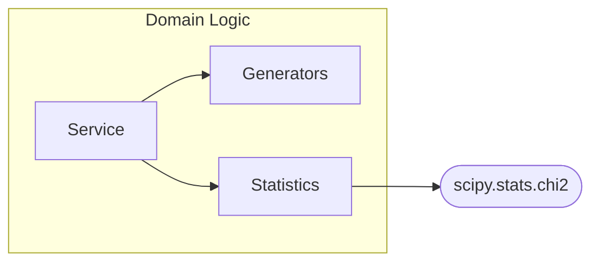
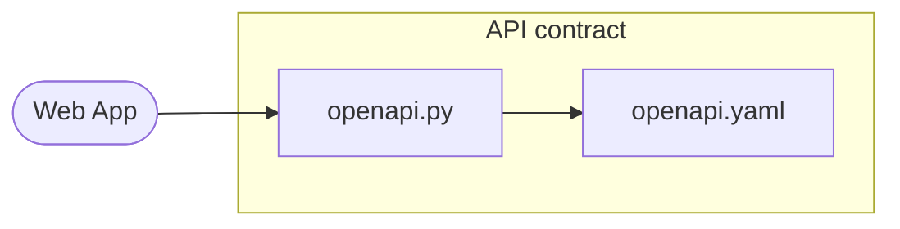
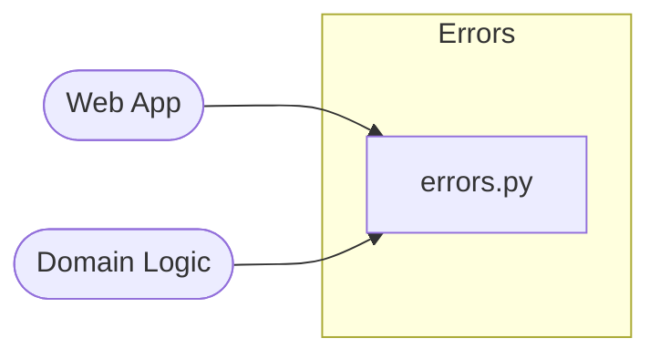

# 5. Building Block View

This chapter shows the static decomposition of the `randomgen` package into its
building blocks.

## 5.1 Overview

| Building block | Responsibility |
| --- | --- |
| Web App | Turns HTTP requests into service calls and JSON responses. |
| Domain Logic | Generates a sample from a distribution and scores how well it fits. |
| API contract | The design-first OpenAPI spec, served and rendered. |
| Errors | Typed domain exceptions, mapped to HTTP 400. |

Dependencies flow inward: the Web App depends on the Domain Logic, the API
contract, and the Errors; the Domain Logic knows nothing about Flask.

## 5.2 Web App

The HTTP adapter, and the only Flask-aware block. Handlers stay thin: parse the
query, delegate to the Domain Logic, serialize JSON.

| Subcomponent | Role |
| --- | --- |
| [`app.py`](../../src/randomgen/app.py) | The `create_app()` factory and the single error boundary — domain errors become 400, other HTTP errors keep their code, anything else is 500, all as `{"error": ...}`. |
| [`routing.py`](../../src/randomgen/routing.py) | The blueprint and thin route handlers (`/`, `/api/v1`, `/api/v2`, `/openapi.json`, `/docs`, `/health`), plus query parsing. |

## 5.3 Domain Logic

The framework-independent core: generate a sample from a discrete distribution
and score how well it fits. It knows nothing about Flask — the Web App hands it
the quantity and the optional distribution and gets back the numbers plus a
quality report.

| Subcomponent | Role |
| --- | --- |
| Service ([`endpoints.py`](../../src/randomgen/endpoints.py)) | `RandomGenRestApi` orchestrates a request: takes the built-in distribution or validates the caller's, builds the generator, bounds the quantity, draws the sample, and assembles the response. |
| Generators ([`core.py`](../../src/randomgen/core.py)) | `RandomGenABC` plus `RandomGenV1` (inverse-CDF) and `RandomGenV2` (`random.choices`) — one builder interface, with V1 measured ~3× faster ([AD-6](../decisions/006-two-generators-one-interface.md)). |
| Statistics ([`histogram.py`](../../src/randomgen/histogram.py), [`hypothesis.py`](../../src/randomgen/hypothesis.py)) | `Histogram` turns a sample into observed proportions; `ChiSquareTest` scores it against the expected distribution (statistic, degrees of freedom, p-value via scipy). |

## 5.4 API contract

The design-first description of the API: the contract is authored first, and the
service serves it verbatim.

| Subcomponent | Role |
| --- | --- |
| [`openapi.yaml`](../../src/randomgen/openapi.yaml) | The hand-authored OpenAPI 3.1 contract — the single source of truth ([AD-16](../decisions/016-design-first-openapi.md)). |
| [`openapi.py`](../../src/randomgen/openapi.py) | `load_spec()` — loads and caches the contract, served at `/openapi.json` and rendered as ReDoc at `/docs`. A pin test and a route-coverage test keep it in step with the code. |

## 5.5 Errors

The typed domain-exception hierarchy: invalid input fails predictably rather than
crashing a worker.

| Subcomponent | Role |
| --- | --- |
| [`errors.py`](../../src/randomgen/errors.py) | `RandomGenError` base plus nine typed subclasses (wrong type, empty, length mismatch, negative or non-summing probabilities, quantity out of bounds, malformed query); each carries a fixed message and maps to HTTP 400. |
