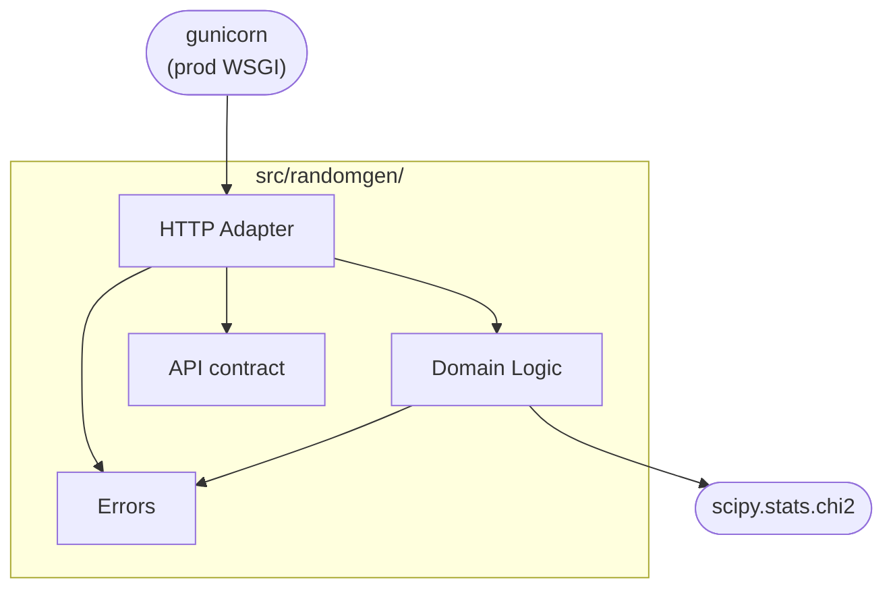
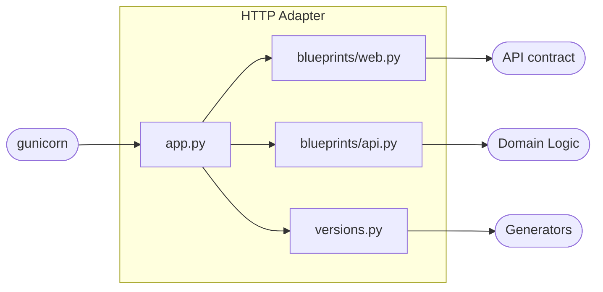
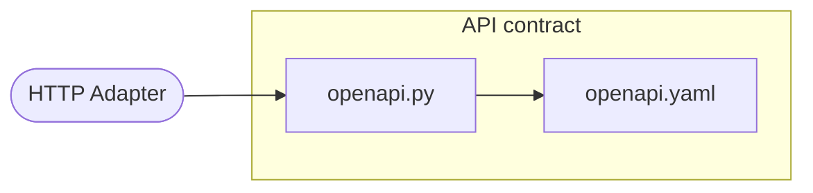
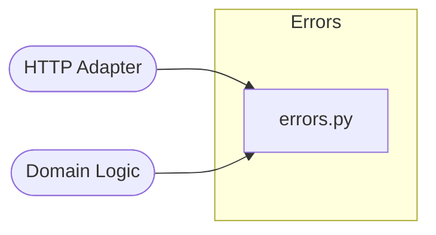

# 5. Building Block View

This chapter shows the static decomposition of the `randomgen` package into its
building blocks.

## 5.1 Overview

| Building block | Responsibility |
| --- | --- |
| HTTP Adapter | Turns HTTP requests into service calls and JSON responses. |
| Domain Logic | Generates a sample from a distribution and scores how well it fits. |
| API contract | The design-first OpenAPI spec, served and rendered. |
| Errors | Typed domain exceptions, mapped to HTTP 400. |

Dependencies flow inward: the HTTP Adapter depends on the Domain Logic, the API
contract, and the Errors; the Domain Logic knows nothing about Flask.

## 5.2 HTTP Adapter

The only Flask-aware block. Routes are grouped into blueprints by audience and
registered by the application factory; handlers stay thin (parse the query,
delegate to the Domain Logic, serialize JSON).

| Subcomponent | Role |
| --- | --- |
| [`app.py`](../../src/randomgen/app.py) | The `create_app()` factory — registers the web blueprint and one API blueprint per registered version, plus the single error boundary (domain errors become 400, other HTTP errors keep their code, anything else is 500, all as `{"error": ...}`). |
| [`blueprints/web.py`](../../src/randomgen/blueprints/web.py) | The unversioned, browser- and ops-facing routes (`/`, `/openapi.json`, `/docs`, `/health`). |
| [`blueprints/api.py`](../../src/randomgen/blueprints/api.py) | `make_api_blueprint(version, generator)` builds one `/api/<version>/randomgen` blueprint per generation, and holds the query parsing. |
| [`versions.py`](../../src/randomgen/versions.py) | `API_VERSIONS` — the registry binding each generation to its generator; the single place a version is added, and the only adapter module that imports the generators. |

## 5.3 Domain Logic

The framework-independent core: generate a sample from a discrete distribution
and score how well it fits. It knows nothing about Flask — the HTTP Adapter hands it
the quantity and the optional distribution and gets back the numbers plus a
quality report.

| Subcomponent | Role |
| --- | --- |
| Service ([`service.py`](../../src/randomgen/service.py)) | `RandomGenService` orchestrates a request: takes the built-in distribution or validates the caller's, builds the generator, bounds the quantity, draws the sample, and assembles the response. |
| Generators ([`core.py`](../../src/randomgen/core.py)) | `RandomGenABC` plus `RandomGenV1` (inverse-CDF) and `RandomGenV2` (`random.choices`) — one builder interface, with V1 measured ~3× faster. |
| Statistics ([`histogram.py`](../../src/randomgen/histogram.py), [`hypothesis.py`](../../src/randomgen/hypothesis.py)) | `Histogram` turns a sample into observed proportions; `ChiSquareTest` scores it against the expected distribution (statistic, degrees of freedom, p-value via scipy). |

## 5.4 API contract

The design-first description of the API: the contract is authored first, and the
service serves it verbatim.

| Subcomponent | Role |
| --- | --- |
| [`openapi.yaml`](../../src/randomgen/openapi.yaml) | The hand-authored OpenAPI 3.1 contract — the single source of truth. |
| [`openapi.py`](../../src/randomgen/openapi.py) | `load_spec()` — loads and caches the contract, served at `/openapi.json` and rendered as ReDoc at `/docs`. A pin test and a route-coverage test keep it in step with the code. |

## 5.5 Errors

The typed domain-exception hierarchy: invalid input fails predictably rather than
crashing a worker.

| Subcomponent | Role |
| --- | --- |
| [`errors.py`](../../src/randomgen/errors.py) | `RandomGenError` base plus nine typed subclasses (wrong type, empty, length mismatch, negative or non-summing probabilities, quantity out of bounds, malformed query); each carries a fixed message and maps to HTTP 400. |
