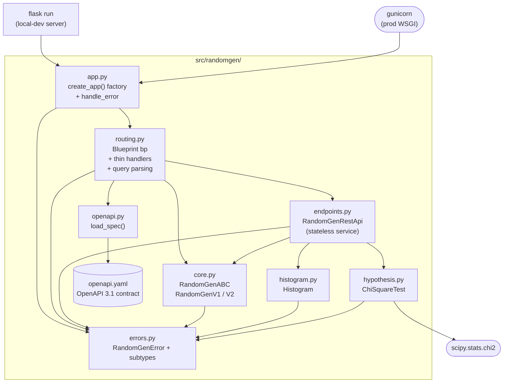

# 5. Building Block View

This section shows the static decomposition of the `randomgen` package into
modules and their dependencies.

## 5.1 Level 1 — package overview

| Building block | Responsibility |
|----------------|----------------|
| [`app.py`](../../src/randomgen/app.py) | Application factory. Builds the Flask app, registers the blueprint and the single `Exception` error handler. |
| [`routing.py`](../../src/randomgen/routing.py) | Flask blueprint `bp`; thin route handlers; query-string parsing helpers. |
| [`endpoints.py`](../../src/randomgen/endpoints.py) | `RandomGenRestApi` — stateless service logic, framework-independent. |
| [`core.py`](../../src/randomgen/core.py) | `RandomGenABC` abstract base and the two concrete generators. |
| [`histogram.py`](../../src/randomgen/histogram.py) | `Histogram` — observed-frequency distribution from a sample. |
| [`hypothesis.py`](../../src/randomgen/hypothesis.py) | `ChiSquareTest` — goodness-of-fit statistic, df, and p-value via `scipy`. |
| [`openapi.py`](../../src/randomgen/openapi.py) | `load_spec()` — loads and caches the `openapi.yaml` contract (served at `/openapi.json`, rendered at `/docs`). |
| [`openapi.yaml`](../../src/randomgen/openapi.yaml) | The hand-authored OpenAPI 3.1 contract — single source of truth for the API (design-first, AD-16). |
| [`errors.py`](../../src/randomgen/errors.py) | `RandomGenError` base plus specific domain exceptions. |

Dependencies flow inward toward `core.py`/`errors.py`; no business logic lives
in `routing.py`, and `endpoints.py`/`core.py` know nothing about Flask.

## 5.2 Level 2 — selected building blocks

### 5.2.1 `app.py` — application factory

- `create_app()` → `Flask` app with `bp` and the error handler registered. The
  app holds no mutable state, so it is created once per gunicorn worker.
- `handle_error(e)` is the **single API error boundary**:
  - `RandomGenError` → **400** `{"error": str(e)}`
  - Werkzeug `HTTPException` (e.g. 404, 405) → its own `e.code` with
    `{"error": e.description}`
  - anything else → **500** `{"error": str(e)}`

### 5.2.2 `routing.py` — blueprint and handlers

- `bp` — the blueprint registered by the factory. `rest_api` — one shared,
  stateless `RandomGenRestApi`. `DEFAULT_QUANTITY = 1000`.
- Routes:
  - `GET /` → `hello_world()` renders the `index.html` home page (HTML)
  - `GET /api/v1/randomgen` → `rest_api.randomgen_endpoint(RandomGenV1, ...)`
  - `GET /api/v2/randomgen` → `rest_api.randomgen_endpoint(RandomGenV2, ...)`
  - `GET /openapi.json` → `load_spec()` serialized as JSON (OpenAPI 3.1)
  - `GET /docs` → renders the `docs.html` ReDoc page over `/openapi.json`
  - `GET /health` → `{"status": "ok"}`, 200
- Query parsing helpers:
  - `quantity_from_query()` — reads `numbers`; defaults to 1000; raises
    `RandomGenQuantityError` on a non-integer (instead of Flask silently
    falling back to the default).
  - `distribution_from_query()` — prefers `dist` (`value:probability` pairs via
    `parse_dist_pairs`), else repeated `value`/`probability`, else
    `(None, None)` to signal "use the built-in distribution."
  - `parse_dist_pairs(raw)` — splits on `,` and partitions each item on `:`;
    raises `RandomGenDistFormatError` on a missing separator or non-numeric side.

### 5.2.3 `endpoints.py` — `RandomGenRestApi` (stateless)

Constants: `DEFAULT_NUMBERS = [-1, 0, 1, 2, 3]`,
`DEFAULT_PROBABILITIES = [0.01, 0.3, 0.58, 0.1, 0.01]`, `MAX_NUMBERS = 10000`.

| Method | Responsibility |
|--------|----------------|
| `validate_distribution(numbers, probabilities)` | Type, non-empty, equal length, non-negative weights, and `round(sum, 3) == 1`. |
| `randomgen_endpoint(randomgen_type, quantity, values, probabilities)` | Defaults to the built-in distribution when neither is supplied; otherwise validates the caller's; builds the generator (`set_numbers().set_probabilities().validate()`); delegates to `generate_random_numbers`. |
| `generate_random_numbers(randomgen, quantity, numbers, probabilities)` | Enforces `1 ≤ quantity ≤ MAX_NUMBERS`; draws the sample; builds expected (from probabilities) and observed (`Histogram`) histograms; runs `ChiSquareTest`; assembles the response dict. |

### 5.2.4 `core.py` — generators (V1 vs. V2)

`RandomGenABC` provides the builder-style fluent interface
(`set_numbers`, `set_probabilities`, `validate`, `calc_cdf`, `from_dict`,
`to_dict`, `generate`) and declares the abstract `next_num()`. `validate()`
checks numbers and probabilities, asserts equal length, and precomputes the
cumulative distribution (CDF). The two implementations differ only in
`next_num()`:

- **`RandomGenV1`** — manual **inverse-CDF** sampling: draws `random.random()`
  and walks `_cumulative_probabilities`, returning the first number whose
  cumulative weight is `>= rand`. A floating-point guard returns the **last**
  number when `rand` exceeds the final cumulative value (which can fall just
  below 1.0), avoiding an implicit `None`.
- **`RandomGenV2`** — delegates to the standard library:
  `random.choices(self._numbers, self._probabilities, k=1)[0]`. (V2 does not
  use the precomputed CDF.) Per the journal ([solution.md](../history/solution.md) §10),
  V2 measured ~3× slower than V1.

### 5.2.5 `histogram.py` and `hypothesis.py`

- **`Histogram`** (a `dict` subclass) — `set_numbers().calc()` counts
  occurrences and stores each value's observed proportion; raises
  `RandomGenEmptyError` on an empty sample.
- **`ChiSquareTest`** — fluent
  `set_observed_numbers().set_expected_numbers().set_expected_probabilities().validate().calc()`.
  `calc()` builds expected counts (`probability × total`), sums
  `(observed − expected)² / expected` over categories with a positive expected
  count, computes `df = len(contributing) − 1`, and
  `p_value = 1 − chi2.cdf(chi_square, df)`. `is_null(alpha=0.05)` returns
  `p_value > alpha`. Passing the explicit expected category labels lets
  categories observed zero times still contribute to the statistic.

### 5.2.6 `errors.py`

`RandomGenError(Exception)` is the base; subclasses carry a fixed `MESSAGE`:
`RandomGenTypeError`, `RandomGenEmptyError`, `RandomGenMismatchError`,
`RandomGenProbabilitySumError`, `RandomGenProbabilityNegativeError`,
`RandomGenMaxError`, `RandomGenMinError`, `RandomGenQuantityError`,
`RandomGenDistFormatError`. All map to HTTP 400 via `handle_error`
([Section 8](08-crosscutting-concepts.md)).

### 5.2.7 `openapi.py` / `openapi.yaml` — API contract

The API is **design-first**: [`openapi.yaml`](../../src/randomgen/openapi.yaml)
is the hand-authored OpenAPI 3.1 contract and the single source of truth
([AD-16](../decisions/016-design-first-openapi.md)). `openapi.py` exposes
`load_spec()`, which loads that file once (`lru_cache`) and returns it
unchanged; `routing.py` serves it verbatim at `/openapi.json` and renders it
with ReDoc at `/docs`. Both are unversioned utility endpoints outside the
`/api/v1`–`/api/v2` contract ([AD-13](../decisions/013-openapi-docs-endpoint.md)).

Because the contract is hand-authored, unit tests keep it from drifting from
the code: one pins the spec's quantity limits and version to the live constants
(`DEFAULT_QUANTITY`, `MAX_NUMBERS`, `__version__`), and one asserts that every
`/api` route on the blueprint appears in the spec — so an undocumented endpoint
or a stale limit fails CI.
