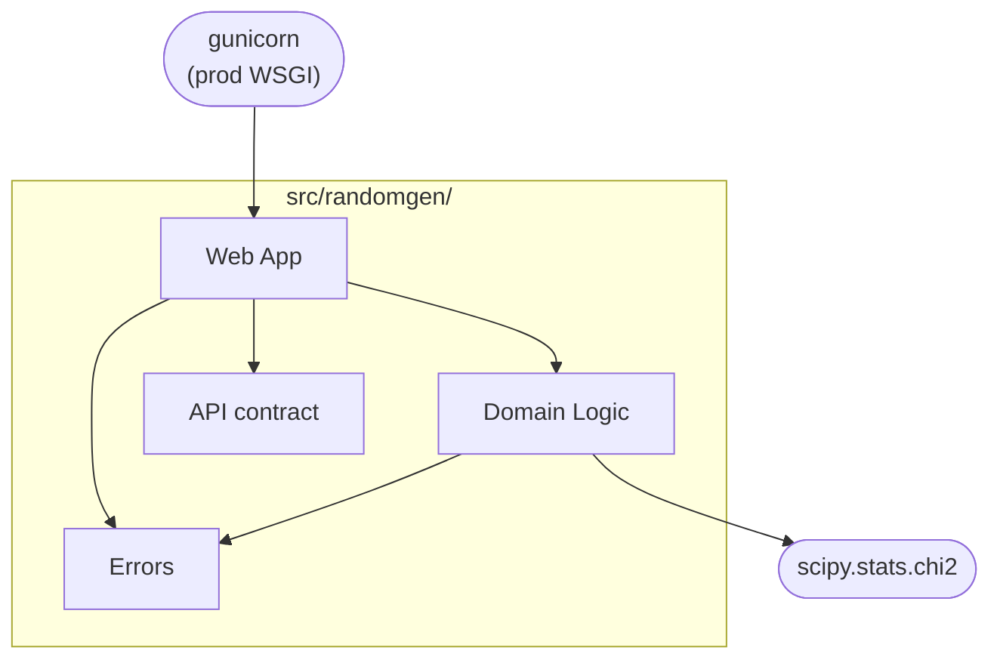

# 5. Building Block View

This chapter shows the static decomposition of the `randomgen` package into its
building blocks.

## 5.1 Level 1

| Building block | Responsibility |
| --- | --- |
| Web App | The Flask application — the `create_app()` factory, the route blueprint, and the single error boundary ([`app.py`](../../src/randomgen/app.py), [`routing.py`](../../src/randomgen/routing.py)). |
| Domain Logic | The stateless, framework-independent core: validate the request, generate the sample, and score it with a Chi-Square goodness-of-fit test ([`endpoints.py`](../../src/randomgen/endpoints.py), [`core.py`](../../src/randomgen/core.py), [`histogram.py`](../../src/randomgen/histogram.py), [`hypothesis.py`](../../src/randomgen/hypothesis.py)). |
| API contract | The hand-authored, design-first OpenAPI 3.1 spec, loaded and served at `/openapi.json` and `/docs` ([`openapi.py`](../../src/randomgen/openapi.py), [`openapi.yaml`](../../src/randomgen/openapi.yaml); [AD-16](../decisions/016-design-first-openapi.md)). |
| Errors | Typed domain exceptions, mapped to a JSON HTTP 400 by the Web App's error boundary ([`errors.py`](../../src/randomgen/errors.py)). |

Dependencies flow inward: the Web App depends on the Domain Logic, the API
contract, and the Errors; the Domain Logic and its parts know nothing about
Flask.

## 5.2 Level 2 — Domain Logic

The Domain Logic is the one block with internal structure worth showing. It
splits into three parts, each independently testable and free of Flask:

| Part | Responsibility |
| --- | --- |
| Service ([`endpoints.py`](../../src/randomgen/endpoints.py)) | `RandomGenRestApi` orchestrates a request: it takes the built-in distribution or validates the caller's, builds the generator, bounds the quantity, draws the sample, and assembles the response. |
| Generators ([`core.py`](../../src/randomgen/core.py)) | `RandomGenABC` plus two interchangeable implementations — `RandomGenV1` (manual inverse-CDF) and `RandomGenV2` (`random.choices`); one builder interface, with V1 measured ~3× faster ([AD-6](../decisions/006-two-generators-one-interface.md)). |
| Statistics ([`histogram.py`](../../src/randomgen/histogram.py), [`hypothesis.py`](../../src/randomgen/hypothesis.py)) | `Histogram` turns a sample into observed proportions; `ChiSquareTest` scores it against the expected distribution (statistic, degrees of freedom, p-value via scipy). |
