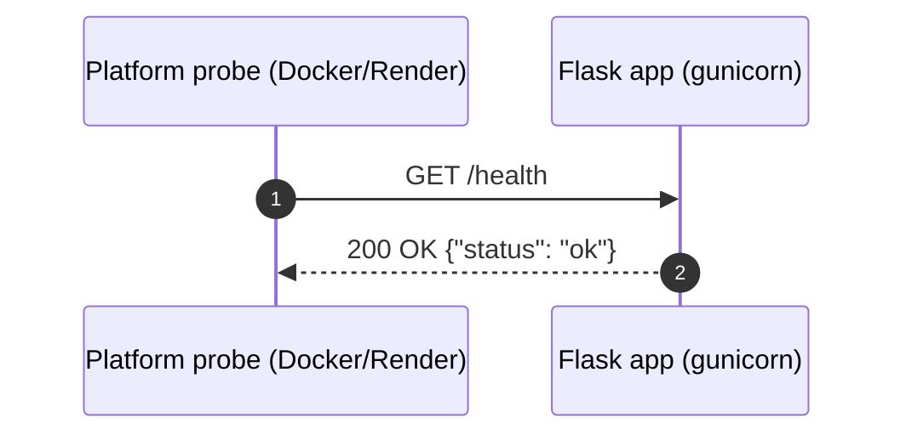

# 6. Runtime View

This section shows how the building blocks from
[Section 5](05-building-block-view.md) collaborate at runtime for the most
important scenarios.

## 6.1 Scenario: `GET /api/v1/randomgen`

A client requests a sample from the default (or an overridden) distribution.
The handler parses the query, the stateless service validates and generates,
the statistical helpers score the sample, and the response is serialized to
JSON.

```mermaid
sequenceDiagram
    autonumber
    participant C as Client
    participant F as Flask app (gunicorn)
    participant R as routing.api_v1_randomgen
    participant API as RandomGenRestApi
    participant G as RandomGenV1
    participant H as Histogram
    participant X as ChiSquareTest
    participant EH as handle_error

    C->>F: GET /api/v1/randomgen?numbers&dist|value/probability
    F->>R: dispatch
    R->>R: quantity_from_query()
    R->>R: distribution_from_query()
    Note over R: non-integer numbers / malformed dist<br/>raise RandomGenError → EH → 400

    R->>API: randomgen_endpoint(RandomGenV1, quantity, values, probabilities)
    alt no distribution supplied
        API->>API: use DEFAULT_NUMBERS / DEFAULT_PROBABILITIES
    else caller-supplied
        API->>API: validate_distribution(values, probabilities)
    end
    API->>G: set_numbers().set_probabilities().validate()
    Note over G: validate length, weights sum≈1; calc CDF

    API->>API: generate_random_numbers(...)
    Note over API: quantity<=0 → RandomGenMinError<br/>quantity>MAX_NUMBERS → RandomGenMaxError
    loop quantity times
        API->>G: next_num()
        G-->>API: number
    end
    API->>H: set_numbers(sample).calc()
    H-->>API: observed histogram
    API->>X: set_observed/expected... .validate().calc()
    X-->>API: chi_square, p_value, df, is_null
    API-->>R: {numbers, quality{...}}
    R->>F: jsonify(...)
    F-->>C: 200 OK + JSON

    Note over EH: any RandomGenError → 400,<br/>HTTPException → its code,<br/>else → 500, all {"error": ...}
    EH-->>C: 4xx/5xx + {"error": ...}
```

`/api/v2/randomgen` is identical except the handler passes `RandomGenV2`, whose
`next_num()` uses `random.choices`.

### Key runtime rules

- **Stateless per request.** The service and blueprint hold nothing mutable;
  each request builds its own generator, so concurrent requests never share
  state.
- **Two-layer validation.** `routing.py` rejects malformed syntax; the service
  and generator reject invalid distributions.
- **Bounded work.** Each request is bounded to 1–10000 numbers (`MAX_NUMBERS`).

## 6.2 Scenario: `GET /health` (liveness)



Used by the Docker `HEALTHCHECK` and Render's `healthCheckPath`
([Section 7](07-deployment-view.md)). Requires no authentication and touches no
business logic.

## 6.3 Scenario: error handling

Whenever a handler or the service raises, Flask routes the exception to the
single `handle_error` boundary registered in the factory:

- `RandomGenError` (e.g. `RandomGenQuantityError`, `RandomGenMaxError`,
  `RandomGenProbabilitySumError`) → 400 `{"error": "<message>"}`.
- Werkzeug `HTTPException` (e.g. an unknown path → 404) → its own status code.
- Any other exception → 500.

This keeps the JSON error contract uniform across every endpoint — see
[Section 8](08-crosscutting-concepts.md) and the
[OpenAPI contract](../../src/randomgen/openapi.yaml).
