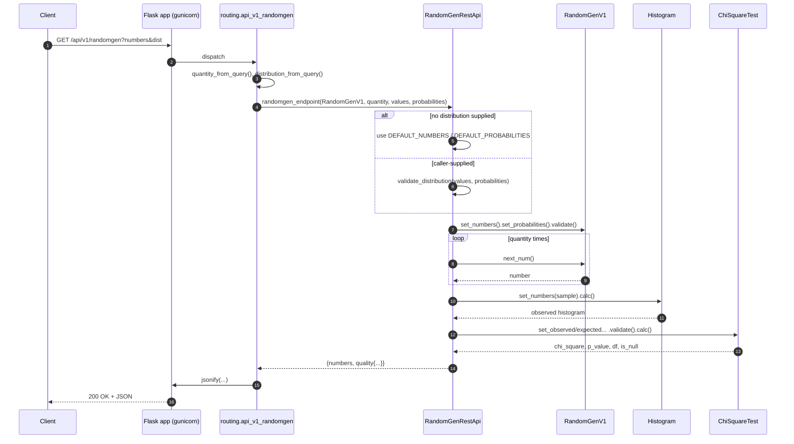
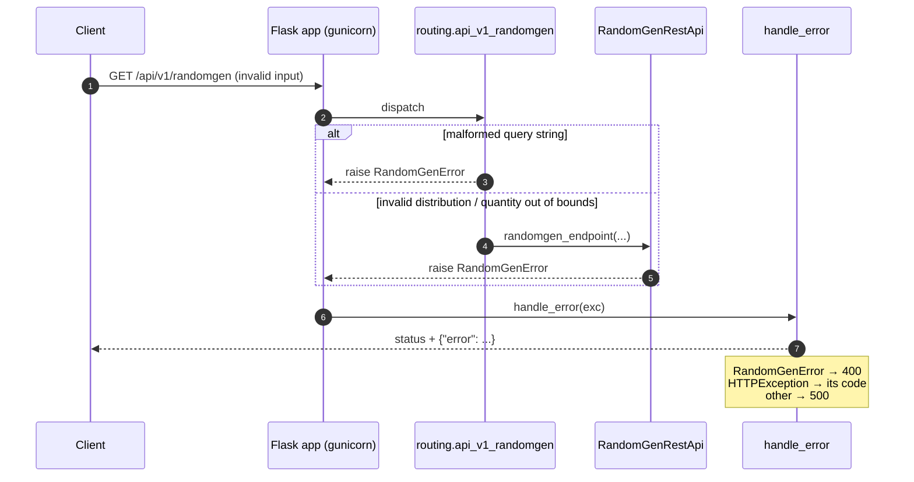
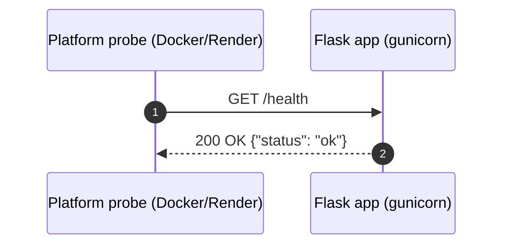

# 6. Runtime View

This chapter shows how the building blocks from
[Chapter 5](05-building-block-view.md) collaborate at runtime for the most
important scenarios.

## 6.1 Happy path

A client requests a sample from the default (or an overridden) distribution. The
handler parses the query, the stateless service validates and generates, the
statistical helpers score the sample, and the response is serialized to JSON.

`/api/v2/randomgen` is identical except the handler passes `RandomGenV2`, whose
`next_num()` uses `random.choices`.

## 6.2 Error path

A malformed query or an invalid distribution raises a typed `RandomGenError` —
from the query parsing in `routing.py` or from validation in the service. Flask
routes any exception to the single `handle_error` boundary registered in the
factory.

The mapping keeps the JSON error contract uniform across every endpoint:

- `RandomGenError` (e.g. `RandomGenQuantityError`, `RandomGenMaxError`,
  `RandomGenProbabilitySumError`) → 400 `{"error": "<message>"}`.
- Werkzeug `HTTPException` (e.g. an unknown path → 404) → its own status code.
- Any other exception → 500.

See [Chapter 8](08-crosscutting-concepts.md) and the
[OpenAPI contract](../../src/randomgen/openapi.yaml).

## 6.3 Health check

Used by the Docker `HEALTHCHECK` and Render's `healthCheckPath`
([Chapter 7](07-deployment-view.md)). Requires no authentication and touches no
business logic.

## 6.4 Runtime rules

- **Stateless per request.** The service and blueprint hold nothing mutable;
  each request builds its own generator, so concurrent requests never share
  state.
- **Two-layer validation.** `routing.py` rejects malformed syntax; the service
  and generator reject invalid distributions.
- **Bounded work.** Each request is bounded to 1–10000 numbers (`MAX_NUMBERS`).
