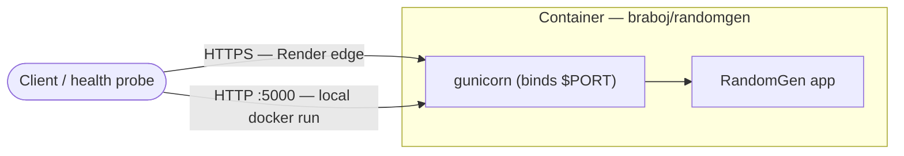
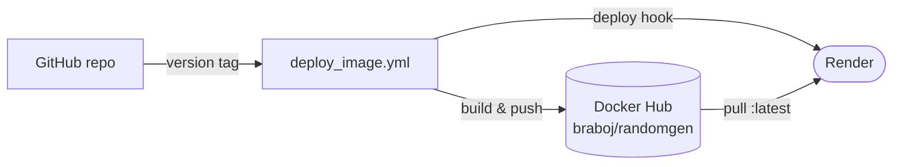

# 7. Deployment View

RandomGen ships as a single self-contained Docker image. The same image runs
locally, is published to Docker Hub, and is deployed as a free Render web
service — no database, shared storage, or clustering to coordinate.

## 7.1 Runtime topology

The image runs as one container. A client reaches it over HTTPS through Render's
edge, or over plain HTTP against a local `docker run`. Inside the container,
gunicorn (the process) binds the port and serves the app.



## 7.2 Release and deploy

A version tag drives a release: CI builds and pushes the image to Docker Hub,
then pings Render's deploy hook so it pulls the new image.



## 7.3 Infrastructure elements

| Element | Details |
|---------|---------|
| Base image | `python:3.12.2-alpine3.19`, pinned by digest for reproducibility and integrity. |
| App install | The Dockerfile builds and installs the package with `pip install --no-cache-dir .`; dependencies are declared in `pyproject.toml`. |
| User | Non-root `appuser` (`adduser -D appuser`; `USER appuser`). |
| Process | `gunicorn --bind "0.0.0.0:${PORT:-5000}" "randomgen.app:create_app()"` (shell form so `${PORT}` expands at runtime). |
| Port | `ENV PORT=5000`, `EXPOSE 5000`; PaaS platforms inject `$PORT`. |
| Health | `HEALTHCHECK` every 30s (`timeout 3s`, `start-period 5s`, `retries 3`) hitting `/health` via `python -c urllib.request` (no `curl` in the base image). |

## 7.4 Deployment targets

### Local Deployment

```bash
docker pull braboj/randomgen:latest
docker run -p 5000:5000 braboj/randomgen:latest
```

`flask --app "randomgen.app:create_app" run` is a local-dev convenience only
(Flask's built-in server, debug off); production always serves via gunicorn
inside the image.

### Docker Hub

[`deploy_image.yml`](../../.github/workflows/deploy_image.yml) builds and pushes
the image on version tags (`tags: '*'`), tagging the build and updating `latest`
(`addLatest: true`). Credentials come from the `DOCKER_USERNAME` /
`DOCKER_PASSWORD` repository secrets.

### Render

[`render.yaml`](../../render.yaml) is a blueprint: `type: web`, `runtime: image`
running `docker.io/braboj/randomgen:latest`, `plan: free`, `region: frankfurt`,
`healthCheckPath: /health`. Render injects `$PORT`, which the image's gunicorn
`CMD` binds, so no extra configuration is needed.

A release drives the deploy: after [`deploy_image.yml`](../../.github/workflows/deploy_image.yml)
pushes the image, it POSTs a Render Deploy Hook (the `RENDER_DEPLOY_HOOK_URL`
secret) so Render pulls the new `latest` and redeploys.

> Operational note: free Render instances spin down after ~15 minutes of
> inactivity and cold-start (~30–60s) on the next request — expected for a
> zero-cost demo. This is the dominant availability characteristic of the hosted
> demo (see [Chapter 11](11-risks-and-technical-debt.md)).

## 7.5 Scaling notes

Because the service is stateless, it scales horizontally by running more gunicorn
workers or more container replicas — no coordination or sticky sessions. The
only per-request bound is `MAX_NUMBERS = 10000`, which caps the CPU/memory cost
of a single call.
