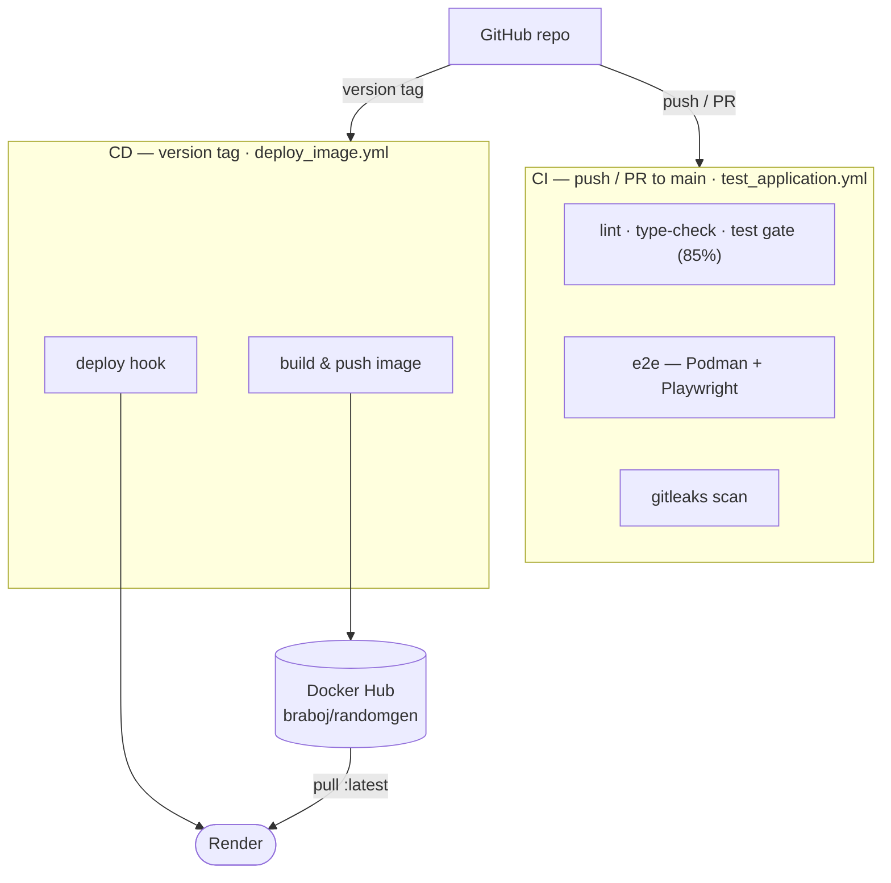

# 7. Deployment View

RandomGen ships as a single self-contained Docker image. The same image runs
locally, is published to Docker Hub, and is deployed as a free Render web
service — no database, shared storage, or clustering to coordinate.

## 7.1 Environments

RandomGen runs in a single deployed environment. A change moves from a
developer's machine, through the CI quality gate, to one hosted target; there is
no separate QA or staging tier.

| Environment | Host | Runs | Role |
| --- | --- | --- | --- |
| Local dev | Developer machine | Flask dev server, or a local `docker run` | Inner development loop. |
| CI gate | GitHub Actions runners | ruff, mypy, pytest, the e2e suite, gitleaks | Enforces quality on each push and PR. Ephemeral, not a deployment. |
| Production | Render free tier | gunicorn in the published image | The live, public demo. |

Quality is enforced at the CI gate rather than in a deployed QA environment: a
change reaches production only after lint, type-check, the pytest gate, the e2e
suite, and a secret scan pass. A standing QA or staging tier would add
infrastructure and release ceremony without catching anything the gate does not —
the service is stateless, has no database, and carries no migration or data-shape
risk, and the target is a zero-cost demo.

## 7.2 Runtime topology

The image runs as one container. A client reaches it over HTTPS through Render's
edge, or over plain HTTP against a local `docker run`. Inside the container,
gunicorn (the process) binds the port and serves the app.


## 7.3 CI/CD pipeline

Two workflows split the pipeline by trigger. Every push or pull request to main
runs the quality gate; a version tag drives the release, which builds and pushes
the image to Docker Hub, then pings Render's deploy hook so it pulls the new
image. The gate's individual checks are listed in
[Chapter 8](08-crosscutting-concepts.md).



## 7.4 Container image

The same image is the unit of deployment everywhere. These are the choices the
Dockerfile bakes into it.

| Element | Details |
|---------|---------|
| Base image | `python:3.12.2-alpine3.19`, pinned by digest for reproducibility and integrity. |
| App install | Built and installed from source with pip; dependencies live in `pyproject.toml`. |
| User | Runs as a non-root user. |
| Process | gunicorn (the production WSGI server) serves the app. |
| Port | Binds `$PORT`, injected by the platform; defaults to 5000. |
| Health | A healthcheck probes `/health` every 30 seconds — via Python, since the base image ships no curl. |

## 7.5 Deployment targets

Where the image is distributed and run: a local Docker host, the Docker Hub
registry it is published to, and the hosted Render service.

### Local Deployment

Pull and run the published image on any Docker host.

```bash
docker pull braboj/randomgen:latest
docker run -p 5000:5000 braboj/randomgen:latest
```

`flask --app "randomgen.app:create_app" run` is a local-dev convenience only
(Flask's built-in server, debug off); production always serves via gunicorn
inside the image.

### Docker Hub

[`deploy_image.yml`](../../.github/workflows/deploy_image.yml) builds and pushes
the image on version tags (`tags: '*'`), tagging the build and updating `latest`
(`addLatest: true`). Credentials come from the `DOCKER_USERNAME` /
`DOCKER_PASSWORD` repository secrets.

### Render

[`render.yaml`](../../render.yaml) is a blueprint: `type: web`, `runtime: image`
running `docker.io/braboj/randomgen:latest`, `plan: free`, `region: frankfurt`,
`healthCheckPath: /health`. Render injects `$PORT`, which the image's gunicorn
`CMD` binds, so no extra configuration is needed.

A release drives the deploy: after [`deploy_image.yml`](../../.github/workflows/deploy_image.yml)
pushes the image, it POSTs a Render Deploy Hook (the `RENDER_DEPLOY_HOOK_URL`
secret) so Render pulls the new `latest` and redeploys.

> Operational note: free Render instances spin down after ~15 minutes of
> inactivity and cold-start (~30–60s) on the next request — expected for a
> zero-cost demo. This is the dominant availability characteristic of the hosted
> demo (see [Chapter 11](11-risks-and-technical-debt.md)).

## 7.6 Scaling notes

Because the service is stateless, it scales horizontally by running more gunicorn
workers or more container replicas — no coordination or sticky sessions. The
only per-request bound is `MAX_NUMBERS = 10000`, which caps the CPU/memory cost
of a single call.
