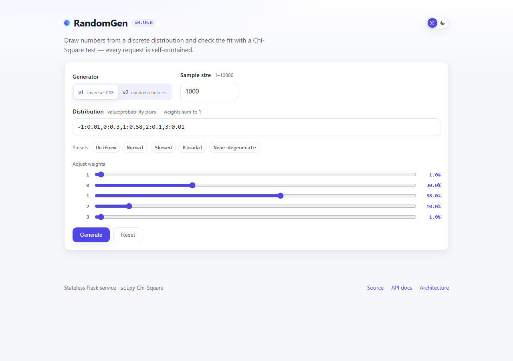
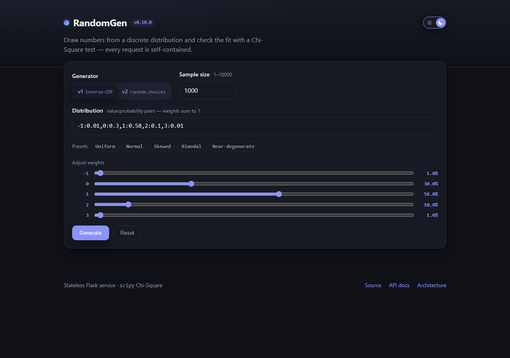
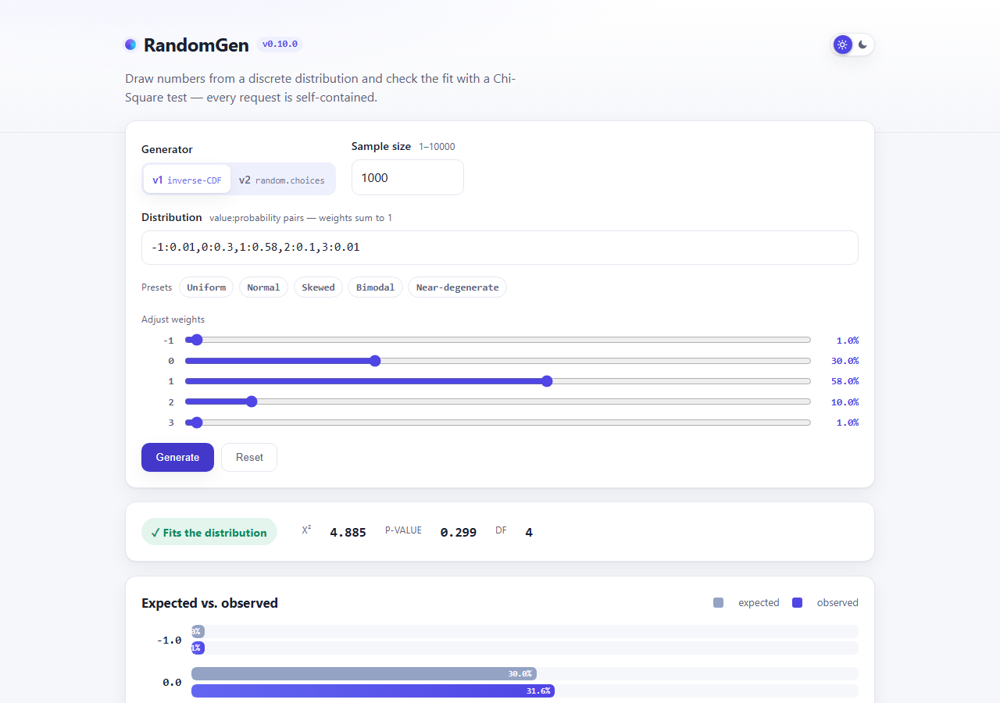
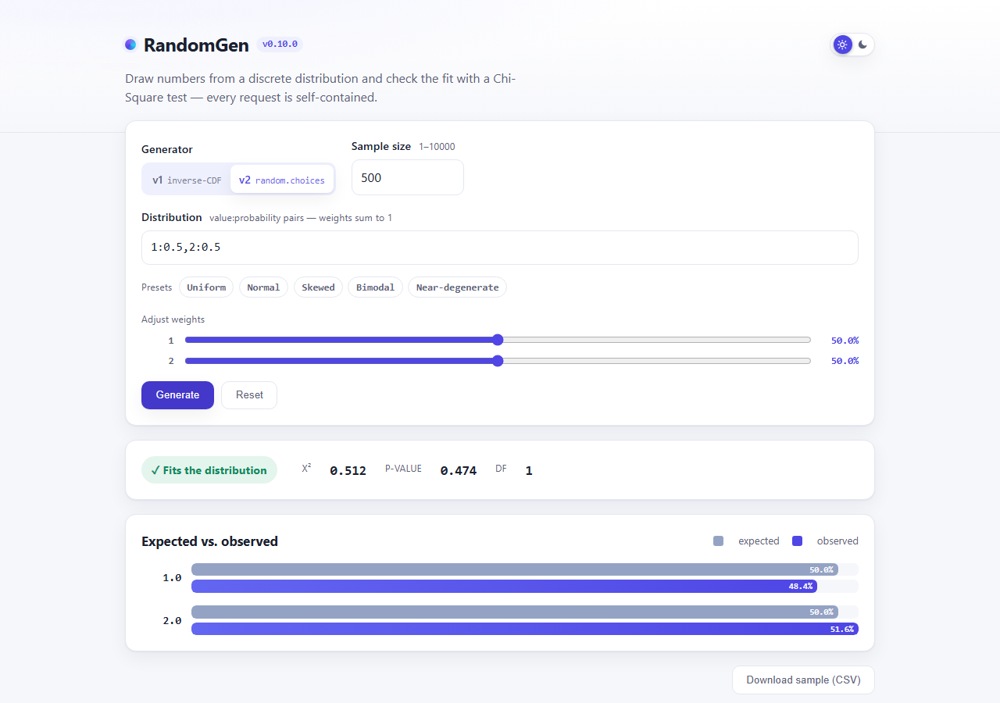
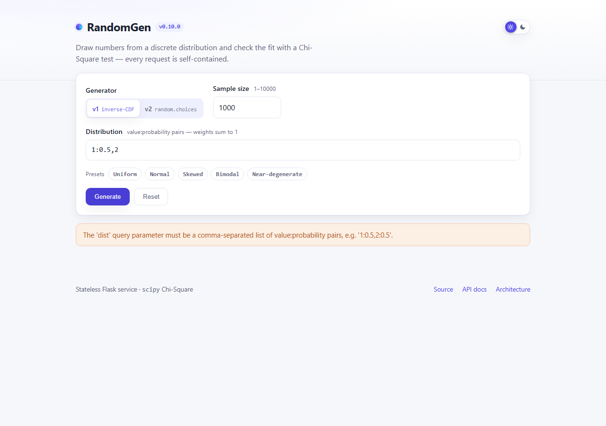
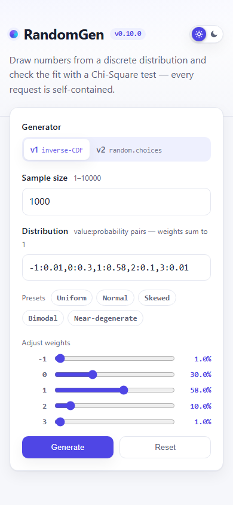

# RandomGen UI snapshots

Captured in Chromium at **v0.11.0** via
[`scripts/capture_ui_snapshots.py`](../../scripts/capture_ui_snapshots.py)
(re-run it to refresh these). The interactive home page lets you pick a
generator (v1/v2), a discrete distribution — typed directly, dialled in with
the per-outcome weight sliders, or set from a one-click preset (Uniform,
Normal, Skewed, Bimodal, Near-degenerate) — and a sample size, then renders the
Chi-Square verdict and an expected-vs-observed histogram. A header toggle
switches between light and dark themes, and the generated sample can be
downloaded as CSV. Every state below is covered by the Playwright e2e test
(`tests/e2e/test_ui.py`).

## Initial state

The full-width distribution field with its presets and weight sliders.

## Dark theme

The header toggle switches to a dark palette (persisted across reloads).

## Preset distribution (Bimodal)

## Results — v1 (built-in distribution)

## Results — v2 (custom distribution `1:0.5,2:0.5`)

## Error state (malformed `dist`)

## Mobile / responsive

