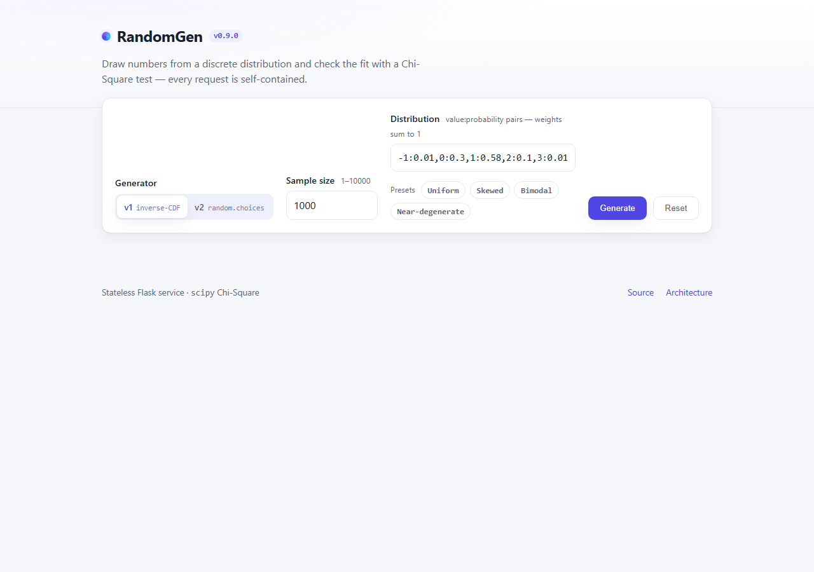
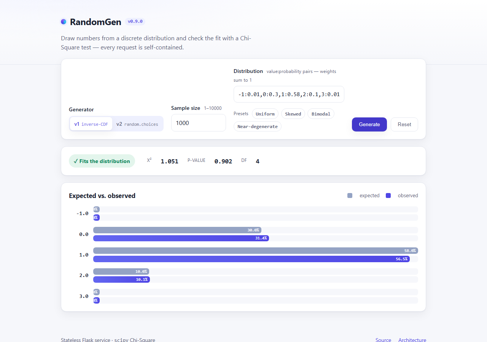
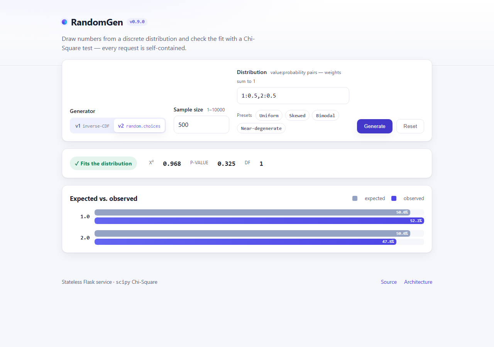
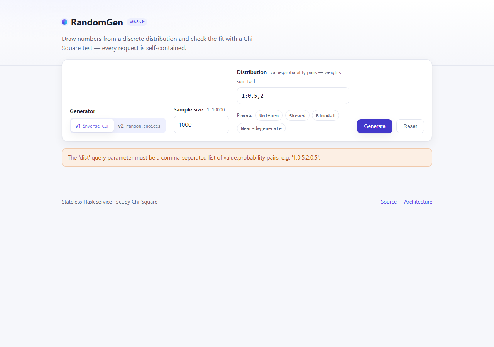
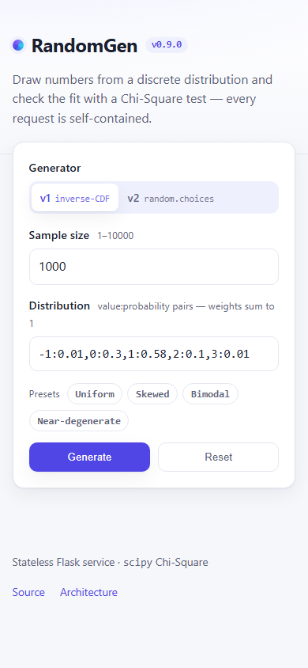

# RandomGen UI snapshots

Captured in Chromium at **v0.9.0** via
[`scripts/capture_ui_snapshots.py`](../scripts/capture_ui_snapshots.py)
(re-run it to refresh these). The interactive home page lets you pick a
generator (v1/v2), a discrete distribution — or a one-click preset (Uniform,
Skewed, Bimodal, Near-degenerate) — and a sample size, then renders the
Chi-Square verdict and an expected-vs-observed histogram. Every state below is
covered by the Playwright e2e test (`tests/e2e/test_ui.py`).

## Initial state

## Preset distribution (Bimodal)

## Results — v1 (built-in distribution)

## Results — v2 (custom distribution `1:0.5,2:0.5`)

## Error state (malformed `dist`)

## Mobile / responsive

